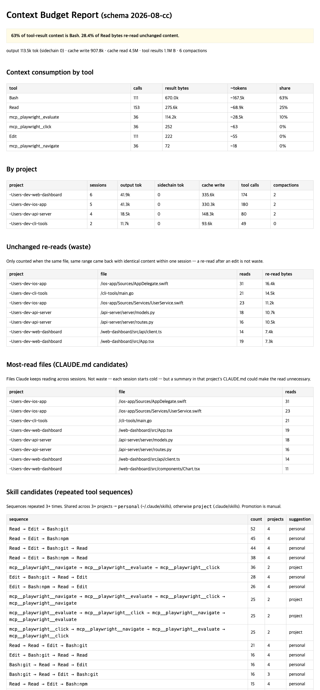

# harnessay

[English](README.md) | 한국어

**Claude Code와 Codex가 컨텍스트를 어디에 쓰는지 찾아줘요.**

Claude Code 기록(`~/.claude/projects/`)과 Codex 기록
(`$CODEX_HOME/sessions`, 기본 `~/.codex/sessions/`)을 로컬에서 분석해요.
harnessay로 이 기록을 분석하면 세 가지를 알 수 있어요. 컨텍스트가 어디서
낭비되는지, 어떤 반복 작업을 스킬로 만들면 좋을지, 스킬을 고친 뒤에도 여전히
잘 동작하는지.

리포트 분석에는 훅이나 API 키가 필요 없고, 데이터는 컴퓨터 밖으로 나가지 않아요.
선택적으로 실행하는 회귀 테스트는 설정된 Claude 또는 Codex CLI를 호출해요.



## 제 기록에서 실제로 찾아낸 것

세션 22개, 프로젝트 10개, 툴 결과 3.9 MB를 분석한 결과예요.

- **툴 결과 컨텍스트의 53%가 Bash 출력이었어요.** 파일 읽기 전체를 합친 것의
  두 배로, 가장 큰 컨텍스트 소비원이었어요.
- **Read 바이트 중 진짜 낭비는 0.2%뿐이었어요.** 재읽기 낭비가 클 거라
  예상했지만, 같은 파일·같은 범위·동일 내용·한 세션 안이라는 기준으로 정확히
  재보니 재읽기는 거의 전부 정당했어요. 진짜 문제는 다른 곳에 있었던 거죠.
- **3개 이상 프로젝트에서 반복된 워크플로가 10개 나왔어요.** 가장 잦은 것은
  152번 반복된 브라우저 자동화 체인으로, 진작 스킬로 만들었어야 했어요.

여러분의 숫자는 다를 거예요. 그게 핵심이에요 — 직접 돌려보세요.

## 빠른 시작

```
/plugin marketplace add nks0614/harnessay
/plugin install harnessay@harnessay
/harnessay
```

플러그인 없이 스크립트만 실행할 수도 있어요.

```bash
git clone https://github.com/nks0614/harnessay.git
python3 harnessay/skills/harnessay/harnessay.py -o report.html
```

Python 3.8 이상과 Claude Code 또는 Codex의 로컬 기록이 필요해요.
서드파티 패키지는 쓰지 않아요. 기본 리포트는 두 도구를 함께 분석해요.
기존 Python 호출 `aggregate(path)`는 호환성을 위해 Claude 전용으로 유지해요.

### Codex에서 사용하기

이 저장소에는 `.agents/skills/harnessay`가 공용 스킬을 가리키도록 연결돼 있어요.
Codex에서 이 폴더를 열고 `$harnessay`를 입력하거나 스킬 선택기에서 선택하세요.
다른 프로젝트에서도 쓰려면 이 저장소에서 다음 명령을 실행하세요.

```bash
mkdir -p ~/.agents/skills
ln -s "$PWD/skills/harnessay" ~/.agents/skills/harnessay
```

기존 설치가 있다면 덮어쓰지 않아요. 경로와 심볼릭 링크 지원은
[Codex 공식 스킬 문서](https://developers.openai.com/codex/skills)를 기준으로 했어요.

```bash
python3 skills/harnessay/harnessay.py --source codex -o report-codex.html
python3 skills/harnessay/harnessay.py --source all --since 2026-09-01 -o report-all.html
python3 skills/harnessay/harnessay.py --source claude /path/to/claude/projects
python3 skills/harnessay/harnessay.py --source codex --codex-dir /path/to/sessions
```

Codex 프로젝트에는 `codex:` 접두사가 붙어요. Claude 하위 에이전트 기록도
포함하며, 해당 출력 토큰은 sidechain으로 분리해요.

## 기간 비교와 원문 추적

기준 기간을 저장하고, 같은 도구를 선택해 다음 기간과 비교할 수 있어요.

```bash
python3 skills/harnessay/harnessay.py --source codex --since 2026-09-01 --until 2026-09-08 --json-out report-before.json -o report-before.html
python3 skills/harnessay/harnessay.py --source codex --since 2026-09-08 --until 2026-09-15 --compare report-before.json --json-out report-after.json -o report-after.html
```

날짜는 UTC 기준이며 시작일은 포함하고 종료일은 제외해요. 기간을 지정하면 날짜가
없는 기록은 제외하고 진단에 표시해요. 총량과 세션당 지표를 비교하며, 기간 길이가
다르거나 경계가 없으면 안내해요. 기준이 0이라 계산할 수 없는 변화율은 `n/a`예요.
작업·모델·프로젝트 구성이 달라도 수치가 변하므로 스킬 효과의 인과관계를 보장하지 않아요.

리포트에는 큰 출력 20개, 재읽기 사례, 스킬 후보별 최대 3개의 원문 위치가 나와요.
링크는 로컬 JSONL 파일을 열고, 표시된 줄 번호로 기록을 찾을 수 있어요.
JSON에는 통계와 원문 경로가 들어가며 실제 프롬프트·출력 본문은 복사하지 않아요.
경로도 개인 정보일 수 있어 생성된 `report*.html`, `report*.json`은 Git에서 제외해요.
비교할 두 스냅샷의 스키마와 `--source`는 같아야 해요.

입력 진단에서는 손상된 JSON·문자 인코딩, 잘못된 중첩 데이터, 미지원 기록,
읽기 실패, 날짜 누락, 상속 이력과 중복 제외 수를 확인할 수 있어요.
부모 메타데이터로 확인된 포크 구간만 제외하며, 같은 Codex 세션 계보의 도구·응답 ID는
기간 필터 전에 중복 제거해요. 서로 독립된 세션의 작업은 보존해요.

## 최적화 루프

harnessay는 기능 세 개를 묶어 놓은 도구가 아니라, 사용 기록 위에서 도는 하나의
최적화 루프예요.

```
Observe   →  내 컨텍스트는 실제로 어디로 가는가?
Detect    →  어떤 낭비와 반복이 있는가?
Promote   →  어떤 반복 워크플로를 스킬이나 CLAUDE.md / AGENTS.md로 만들 것인가?
Verify    →  그 변경이 실제로 도움이 됐는가?
```

### Observe — 컨텍스트 예산 리포트

`/harnessay`를 실행하면 모든 트랜스크립트를 파싱해서 툴별 컨텍스트 소비,
프로젝트별 합계, compaction 횟수를 집계하고, 한 문장 헤드라인을 보여줘요.

> 53% of tool-result context is Bash. 0.2% of Read bytes re-read unchanged
> content.

습관을 바꾼 뒤에는 `--since YYYY-MM-DD`를 붙여 기간을 좁혀서 다시 재보세요.

### Detect — 낭비와 반복

- **Unchanged re-reads**: 같은 파일의 같은 범위가 동일한 내용으로 한 세션
  안의 같은 컨텍스트 구간에서 다시 들어온 경우만 낭비로 세요. 내용이 바뀌거나
  압축 이후 다시 읽으면 제외해요. 현재는 Claude의 구조화된 `Read` 호출만 지원해요.
- **Most-read files**: 구조화된 `Read` 호출이 5회 이상인 파일이에요. 해당 프로젝트의
  CLAUDE.md나 AGENTS.md에 요약을 넣으면 반복 읽기가 줄어드는지 검토하세요.
  현재 기준은 서로 다른 세션 수가 아니라 호출 횟수예요.
- **반복 툴 시퀀스**: 세션별 툴 호출을 n-gram(연속된 호출 묶음)으로 세요.
  Bash는 `git`, `npm` 같은 명령 첫 단어로 구분하고, `Read → Edit` 같은 일반
  편집 루프는 걸러내요.

### Promote — 스킬 후보

3번 이상 반복된 시퀀스를 스킬 후보로 보여줘요. 3개 이상 프로젝트에서 나오면
**personal** 스킬(`~/.claude/skills`), 한 프로젝트에서만 나오면 **project**
스킬(`.claude/skills`)을 권해요. Codex에서는 각각 `~/.agents/skills`,
`.agents/skills`를 사용해요. harnessay는 스킬을 만들지 않아요 — 증거만
보여주고, 만들지는 여러분이 결정해요.

### Verify — 스킬 회귀 테스트

스킬마다 골든 태스크를 정의해 두고 `claude -p`로 한꺼번에 실행하면, 통과율이
`results.jsonl`에 쌓여요. CLI에 설정된 계정과 모델을 사용해요.

```
/harnessay eval
```

```json
{
  "id": "my-skill-smoke",
  "skill": "my-skill",
  "prompt": "/my-skill 늘 하던 그 작업",
  "check": { "type": "regex", "value": "기대하는 출력 패턴" },
  "model": "claude-haiku-4-5"
}
```

Codex 연결 확인용 태스크는 다음처럼 실행해요. 설정된 기본 모델을 사용해요.

```bash
python3 skills/harnessay/evalrun.py skills/harnessay/eval/tasks.codex.json --provider codex
```

커스텀 태스크의 `provider`가 `--provider`보다 우선해요. `model`을 생략하면
해당 CLI의 기본 모델을 써요. Codex는 읽기 전용 환경에서 실행해요.
기본 Codex 태스크는 CLI 연결만 확인하며 스킬 호출 여부를 증명하지 않아요.

태스크를 실행할 때마다 계정 사용량을 소모하니, 스킬당 태스크 1~2개로 작게
유지하세요. 체크는 출력 문자열 기반(`contains`/`regex`)이에요. 저장소 상태나
테스트 exit code 검증은 로드맵에 있어요. 그래서 지금의 PASS는 "스킬이 실행되고
올바르게 답했다"는 뜻이지, "저장소가 멀쩡하다"는 보장이 아니에요.

## 뭐가 다른가요?

사용량 트래커(ccusage, `/usage`)는 **얼마나** 썼는지 알려줘요. 트레이스 뷰어는
**한 번의 실행**을 들여다보게 해줘요. 스킬 생성기는 스킬을 **대신** 만들어줘요.
harnessay는 그 사이의 루프를 맡아요. 쌓인 기록을 관찰하고, 낭비와 반복을 찾고,
재사용할 지시로 승격하고, 그 변경이 실제로 도움이 됐는지 재요. 특히 프로젝트를
가로지르는 시각이 차별점이에요 — 여러 저장소를 굴려야만 드러나는 패턴은 단일
세션 도구로는 볼 수 없어요.

## 프라이버시

트랜스크립트에는 소스 코드, 명령어, 프로젝트 구조가 담길 수 있어요. harnessay는
모든 파싱을 로컬에서 하고, 결과로 정적 `report.html` 파일 하나만 만들어요.
텔레메트리도, 업로드도 없어요. 네트워크를 쓰는 곳은 회귀 테스트가 여러분의
`claude` 또는 `codex` CLI를 호출할 때뿐이에요.

## 한계

- **비공식 포맷이에요.** 트랜스크립트 스키마는 공개 API가 아니에요. 파싱을
  `parse_session()`과 `parse_codex_session()`에 격리하고
  `SCHEMA_VERSION`을 기록했어요. 새 포맷은 파서 수정이 필요할 수 있어요.
- **토큰은 추정치예요.** `~tokens` 열은 토크나이저가 아니라 UTF-8 bytes/4 근사예요.
  과금 추정치가 아니며 이미지 등 비텍스트 결과는 제외해요.
- **Codex 분석 범위에 한계가 있어요.** 기본적으로 활성 `sessions/`만 읽어요.
  보관된 기록이나 클라우드 전용 대화는 자동으로 포함하지 않아요. 셸 명령을 파일
  읽기로 추측하지 않으며, 범용 `exec` 내부의 개별 도구 호출도 복원하지 않아요.
  확인된 포크 구간과 같은 계보의 안정적인 ID는 중복 제거해요.
  경계가 확인되지 않고 ID도 없는 복제 이력은 집계에 남을 수 있어요. Claude와 Codex의
  같은 프로젝트를 자동으로 합치지도 않아요.
- **많이 쓰는 사람을 위한 도구예요.** 인사이트는 사용량에 비례해요. 세션 몇
  개로는 리포트가 빈약해요.

## 개발

```bash
python3 skills/harnessay/test_harnessay.py   # 합성 기록 검증
python3 skills/harnessay/test_evalrun.py     # 오프라인 CLI 모의 검증, 계정 사용량 없음
python3 skills/harnessay/test_report_data.py # JSON 내보내기·비교 검증
```

모든 코드는 `skills/harnessay/`에 있어요. `SKILL.md`(Claude Code / Codex 공용 진입점),
`harnessay.py`(파서 + 집계 + 리포트), `evalrun.py`(회귀 러너), `report_data.py`(JSON 내보내기·비교),
`eval/tasks.json`(골든 태스크)으로 구성돼요. 파싱 계층과 집계 계층은 일부러
분리해 뒀어요.

[폴더 분석·수정 사항·추가 기능 전체 요약](docs/REVIEW.ko.md)

## 라이선스

[MIT](LICENSE)
