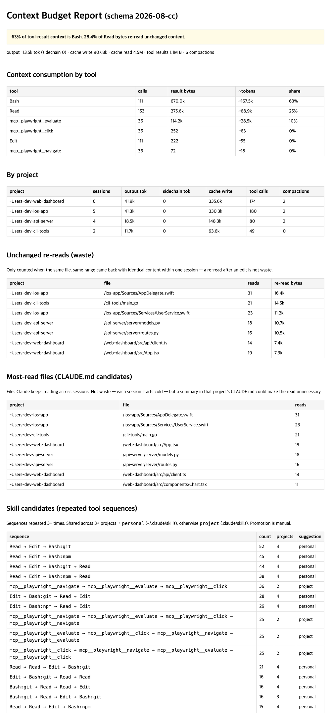

# harnessay

English | [한국어](README.ko.md)

**Find what Claude Code keeps wasting context on.**

harnessay analyzes the Claude Code transcripts already on your machine
(`~/.claude/projects/*/*.jsonl`) to find context waste, repeated workflows
worth turning into skills, and regressions after you change them.

No hooks. No API key. Nothing leaves your machine.



## What it found in my own history

Real output from running harnessay on 22 sessions across 10 projects (3.9 MB
of tool results):

- **53% of tool-result context was Bash output** — the single biggest
  context consumer, twice the size of all file reads combined.
- **Only 0.2% of Read bytes were true waste.** I expected heavy re-read
  waste; measured accurately (same file, same range, identical content,
  within one session), Claude Code's re-reads turned out to be almost always
  justified — the real hog was elsewhere.
- **10 workflows repeated across 3+ projects**, the top one 152 times — a
  browser-automation chain that clearly deserved to be a skill.

Your numbers will differ. That's the point — run it.

## Quick start

```
/plugin marketplace add nks0614/harnessay
/plugin install harnessay@harnessay
/harnessay
```

Or standalone, without the plugin system:

```bash
git clone https://github.com/nks0614/harnessay.git
python3 harnessay/skills/harnessay/harnessay.py -o report.html
```

Requirements: Claude Code, Python 3.8+. No third-party packages.

## The loop

harnessay is one optimization loop over your own usage history, not three
separate features:

```
Observe   →  where does my context actually go?
Detect    →  what waste and repetition shows up?
Promote   →  which repeated workflows should become skills or CLAUDE.md notes?
Verify    →  did the change actually help?
```

### Observe — context budget report

`/harnessay` (or `harnessay.py`) parses every transcript and reports
context consumption by tool, per-project totals, compactions, and a
one-sentence headline:

> 53% of tool-result context is Bash. 0.2% of Read bytes re-read unchanged
> content.

Scope it with `--since YYYY-MM-DD` to re-measure after changing a habit.

### Detect — waste and repetition

- **Unchanged re-reads**: counted only when the same file, same range came
  back with identical content within one session. A re-read after an edit is
  not waste and is not counted.
- **Most-read files**: files Claude reads in session after session — each
  read is individually justified, but a summary in that project's CLAUDE.md
  would make it unnecessary.
- **Repeated tool sequences**: n-grams over each session's tool calls (Bash
  keyed by leading command), with generic editing loops (`Read → Edit`)
  filtered out.

### Promote — skill candidates

Sequences repeated 3+ times are suggested as candidates: shared across 3+
projects → **personal** skill (`~/.claude/skills`), confined to one project →
**project** skill (`.claude/skills`). harnessay never generates skills — it
presents evidence, you decide.

### Verify — skill regression harness

Golden tasks per skill, batch-run with `claude -p` on your existing
subscription, pass rate accumulated in `results.jsonl`:

```
/harnessay eval
```

```json
{
  "id": "my-skill-smoke",
  "skill": "my-skill",
  "prompt": "/my-skill do the usual thing",
  "check": { "type": "regex", "value": "expected output pattern" },
  "model": "claude-haiku-4-5"
}
```

Each task consumes subscription quota — keep suites small (1–2 per skill).
Checks are output-based (`contains`/`regex`); repository-state and test-exit
checks are on the roadmap, so treat a PASS as "the skill ran and answered
correctly", not "the repo is guaranteed intact".

## How is this different?

Usage trackers (ccusage, `/usage`) tell you **how much** you spent. Trace
viewers let you inspect **one run**. Skill generators write skills **for**
you. harnessay covers the loop between them: observe your accumulated
history, find what's wasted and repeated, promote it into reusable
instructions, and measure whether that actually helped. Its cross-project
view is the differentiator — patterns that only show up when you run several
repos are invisible to single-session tools.

## Privacy

Transcripts can contain source code, commands, and project structure.
harnessay parses them entirely locally and writes a static `report.html`.
No telemetry, no uploads; the only network activity is the regression
harness invoking your own `claude` CLI.

## Limitations

- **Unofficial format.** The transcript schema is not a public API. Parsing
  is isolated in `parse_session()` and stamped with `SCHEMA_VERSION`;
  breakage from a Claude Code update should touch one function.
- **Estimated tokens.** `~tokens` is a bytes/4 approximation, not a
  tokenizer.
- **Heavy-user tool.** Insights scale with usage; a handful of sessions
  produces a thin report.

## Development

```bash
python3 skills/harnessay/test_harnessay.py   # self-check, no fixtures
```

Everything lives in `skills/harnessay/`: `SKILL.md` (Claude Code entry
point), `harnessay.py` (parser + aggregation + report), `evalrun.py`
(regression runner), `eval/tasks.json` (golden tasks). Parsing and
aggregation are deliberately separate layers.

## License

[MIT](LICENSE)
